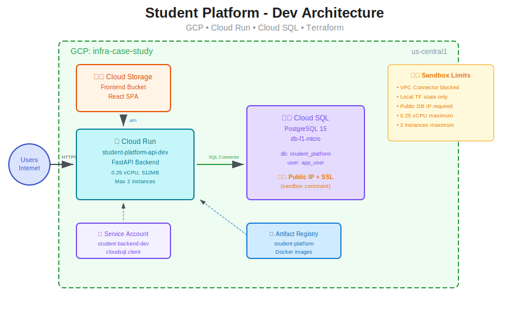

# Student Platform - GCP Infrastructure Case Study

A full-stack student management platform deployed on Google Cloud Platform using Terraform. Demonstrates production-ready infrastructure patterns, serverless architecture, and business rules enforcement.

## Architecture

### Development Architecture (Deployed)



| Component | Technology | Purpose |
|-----------|------------|---------|
| **Infrastructure** | Terraform | Modular, repeatable deployments |
| **Backend** | FastAPI on Cloud Run | Serverless, auto-scaling API |
| **Database** | Cloud SQL PostgreSQL 15 | Managed relational database |
| **Frontend** | HTML/JS on Cloud Storage | Static hosting |
| **Container Registry** | Artifact Registry | Docker image storage |

### Production Architecture (Ideal)


Production enhancements include:
- **Cloud CDN** - Global edge caching for static assets
- **Global Load Balancer** - SSL termination, health checks
- **Cloud Armor** - WAF, DDoS protection, rate limiting
- **VPC Connector** - Private database connectivity
- **Cloud SQL HA** - Regional high availability with read replicas
- **Memorystore** - Redis caching layer
- **Secret Manager** - Secure credential storage

## Business Rules

The platform enforces the following enrollment rules:

| Rule | Description |
|------|-------------|
| **5-Class Limit** | Students cannot enroll in more than 5 classes per semester |
| **Prerequisites** | Students must complete prerequisite classes before enrolling |
| **Class Capacity** | Classes have a maximum enrollment limit (default: 30) |
| **Unique Enrollment** | Students cannot enroll in the same class twice per semester |

## API Endpoints

```
Health & Admin:
GET  /                    → API info
GET  /health              → Health check
POST /migrate             → Create DB tables

Teachers:
GET  /api/v1/teachers/    → List all
POST /api/v1/teachers/    → Create
GET  /api/v1/teachers/{id} → Get one

Students:
GET  /api/v1/students/    → List all
POST /api/v1/students/    → Create
GET  /api/v1/students/{id} → Get one

Classes:
GET  /api/v1/classes/     → List (optional ?semester=)
POST /api/v1/classes/     → Create
GET  /api/v1/classes/{id} → Get with prerequisites
POST /api/v1/classes/{id}/prerequisites → Add prerequisite

Enrollments:
GET  /api/v1/enrollments/ → List (optional ?student_id= or ?class_id=)
POST /api/v1/enrollments/ → Create (validates all rules)
GET  /api/v1/enrollments/student/{id}/semester/{sem}/count → Get count
PATCH /api/v1/enrollments/{id}/complete?grade=A → Mark complete
```

## Demo Commands

```bash
# Check enrollment count (shows 5/5)
curl https://student-platform-api-dev-73rpnkg6jq-uc.a.run.app/api/v1/enrollments/student/1/semester/Fall2024/count

# Try 6th enrollment - FAILS (5-class limit)
curl -X POST https://student-platform-api-dev-73rpnkg6jq-uc.a.run.app/api/v1/enrollments/ \
  -H "Content-Type: application/json" \
  -d '{"student_id": 1, "class_id": 6, "semester": "Fall2024"}'
# → "Student already enrolled in 5 classes this semester"

# Try enroll without prerequisite - FAILS
curl -X POST https://student-platform-api-dev-73rpnkg6jq-uc.a.run.app/api/v1/enrollments/ \
  -H "Content-Type: application/json" \
  -d '{"student_id": 3, "class_id": 2, "semester": "Fall2024"}'
# → "Missing prerequisites: Intro to CS"
```

## Database Schema

```
┌─────────────────┐       ┌─────────────────────┐       ┌─────────────────┐
│    teachers     │       │       classes       │       │    students     │
├─────────────────┤       ├─────────────────────┤       ├─────────────────┤
│ id (PK)         │       │ id (PK)             │       │ id (PK)         │
│ name            │       │ name                │       │ name            │
│ email (unique)  │       │ code                │       │ email (unique)  │
│ department      │       │ semester            │       │ student_id (uq) │
└────────┬────────┘       │ max_students        │       │ grade_level     │
         │                │ teacher_id (FK)─────┘       └────────┬────────┘
         └────────────────┤                                      │
                          └──────────┬──────────┘                │
                                     │                           │
              ┌───────────────────────┐   ┌──────────────────────┴───────┐
              │ class_prerequisites   │   │       enrollments            │
              ├───────────────────────┤   ├──────────────────────────────┤
              │ class_id (PK, FK)     │   │ id (PK)                      │
              │ prerequisite_id (FK)  │   │ student_id (FK)              │
              └───────────────────────┘   │ class_id (FK)                │
                                          │ semester                     │
                                          │ status (enrolled/completed)  │
                                          │ grade                        │
                                          └──────────────────────────────┘
```

## Project Structure

```
student-platform/
├── backend/
│   ├── app/
│   │   ├── routes/          # API endpoints
│   │   ├── services/        # Business logic
│   │   ├── models.py        # SQLAlchemy models
│   │   ├── schemas.py       # Pydantic schemas
│   │   ├── database.py      # DB connection
│   │   └── main.py          # FastAPI app
│   ├── Dockerfile
│   └── requirements.txt
├── terraform/
│   ├── modules/
│   │   ├── networking/      # VPC, subnets
│   │   ├── database/        # Cloud SQL
│   │   ├── backend/         # Cloud Run
│   │   └── frontend/        # Cloud Storage
│   └── environments/
│       └── dev/             # Dev environment
├── docs/
│   ├── architecture-dev.svg
│   └── architecture-prod.svg
└── deploy.sh                # Build & push script
```

## Deployment

### Prerequisites

- GCP Project with billing enabled
- Service account with appropriate permissions
- Docker installed locally
- Terraform/OpenTofu installed

### Deploy Infrastructure

```bash
cd terraform/environments/dev
cp terraform.tfvars.example terraform.tfvars
# Edit terraform.tfvars with your values

terraform init
terraform apply
```

### Deploy Backend

```bash
./deploy.sh
cd terraform/environments/dev
terraform apply
```

### Initialize Database

```bash
curl -X POST https://YOUR-CLOUD-RUN-URL/migrate
```

## Challenges & Solutions

| Challenge | Solution |
|-----------|----------|
| VPC Connector blocked by org policy | Used Cloud SQL Python Connector with public IP |
| us-east1 region restricted | Deployed to us-central1 |
| Cloud Run CPU limits (0.25 max) | Configured cpu_idle=true for fractional CPU |
| Remote TF state blocked | Used local state (documented GCS for prod) |

## Production Recommendations

- [ ] Remote state in GCS with locking
- [ ] Separate GCP projects for dev/staging/prod
- [ ] Secret Manager for credentials
- [ ] Cloud Armor WAF rules
- [ ] VPC Connector for private DB access
- [ ] Cloud SQL regional HA with read replicas
- [ ] Cloud Monitoring dashboards and alerts
- [ ] CI/CD pipeline with Cloud Build

## Tech Stack

- **Cloud:** Google Cloud Platform
- **IaC:** Terraform
- **Backend:** Python, FastAPI, SQLAlchemy
- **Database:** PostgreSQL 15
- **Container:** Docker, Artifact Registry
- **Compute:** Cloud Run (serverless)
- **Storage:** Cloud Storage (static hosting)

## License

MIT
